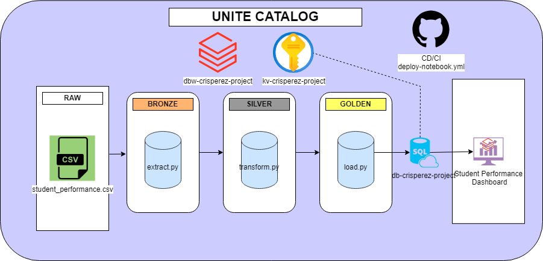

# 🌟 **Proyecto ETL Medallion – Student Performance Analytics**  
### Azure Databricks • Delta Lake • Azure SQL • GitHub Actions • UC Catalog

<div align="center">

[]()  []()  []()  []()  []()  []()

</div>


---

# 🎯 **Descripción del Proyecto**

Este repositorio contiene el desarrollo completo del proyecto final del curso **Databricks Data Engineer – SmartData**, donde se implementa un **pipeline ETL con arquitectura Medallion (Bronze, Silver y Gold)** para analizar factores que influyen en el rendimiento académico de estudiantes usando:

- Apache Spark + PySpark  
- Azure Databricks + Unity Catalog  
- Delta Lake  
- Azure Key Vault (para secretos)  
- Azure SQL Database (para consumo externo)  
- GitHub Actions (CI/CD)  
- Dashboards en Databricks Lakeview  

El flujo completo incluye **ingestión**, **limpieza**, **transformación**, **agregación**, **modelado analítico** y **exposición a SQL**, con despliegue automático desde GitHub.

---

# 🏛️ **Arquitectura del Pipeline**

```
           CSV – ADLS (Bronze)
                     │
                     ▼
 🥉  Bronze: Ingesta + Normalización ligera
                     │
                     ▼
 🥈  Silver: Limpieza, validaciones, enriquecimiento, variables derivadas
                     │
                     ▼
 🥇  Gold: Tablas de hechos, agregados analíticos y correlaciones
                     │
                     ▼
        Azure SQL Database (Consumo externo)
                     │
                     ▼
          Dashboard Lakeview (Databricks)
```

### 📌 Pipeline ejecutado en Databricks


---

# 📦 **Estructura del Repositorio**

```
CIDDATABRICKS-FINALPROJECT-CRISPEREZ/
│
├── .github/
│   └── workflows/
│       └── deploy-notebook.yml             # CI/CD de Databricks
│       └── Github action - despliegue exitoso.png
│
├── proceso/
│   ├── 1_env-preparation.sql              # Crear catálogo, schemas y external locations
│   ├── 2_extract.py                       # Capa Bronze
│   ├── 3_transform.py                     # Capa Silver
│   ├── 4_load.py                          # Capa Gold
│   ├── 5_azuresql-connection.py           # Exportación a Azure SQL
│   ├── Azure SQL - data golden clonada correctamente.png
│   └── Pipeline databricks - consulta a tabla prod-golden exitoso.png
│
├── dashboard/
│   ├── Student Performance Golden UC.lvdash.json
│   └── Student Performance Golden UC.png
│
├── reversion/
│   ├── drop_tables.sql
│   └── revoke.sql
│
├── seguridad/
│   └── grants.py
│
├── scripts/
│   └── 1_env-preparation.sql
│
└── README.md
```

---

# 🧱 **Capa Bronze – Ingesta y Normalización**
Archivo: `2_extract.py`

Funciones principales:

- Lectura del CSV desde ADLS (`abfss://bronze@stcrisperezproject...`)
- Aplicación de schema explícito
- Normalización de strings
- Corrección de valores categóricos (Yes/No, Low/Medium/High…)
- Agregado de columna `ingestion_date`
- Persistencia en Unity Catalog: `catalog_dev.bronze.student_performance_bronze`
---

# 🥈 **Capa Silver – Limpieza y Enriquecimiento**
Archivo: `3_transform.py`

Transformaciones clave:

- Validaciones de dominio
- Eliminación de nulos críticos
- Creación de variables derivadas:
  - `hours_bucket`
  - `attendance_bucket`
  - `sleep_bucket`
  - `motivation_score`, `parental_involvement_score`, etc.
  - `resource_index`
  - `study_efficiency`
  - `risk_flag`
- Timestamp de procesamiento
- Persistencia en Unity Catalog: `catalog_dev.silver.student_performance_silver`

---

# 🥇 **Capa Gold – Hechos y Agregados**

Se generan:

## **📘 Tabla Hechos** 
`catalog_dev.golden.fact_student_performance`

## **📘 Tabla Analíticas** 
| Tabla | Descripción |
|-------|-------------|
| `agg_exam_by_gender` | Promedio por género |
| `agg_exam_by_hours_bucket` | Impacto de horas de estudio |
| `agg_exam_by_attendance_bucket` | Efecto de asistencia |
| `agg_exam_by_motivation` | Motivación |
| `agg_exam_school_vs_income` | Cruce School_Type × Family_Income |
| `corr_with_exam` | Correlaciones con Exam Score |

---

# 🗄️ **Exportación Gold → Azure SQL**

#### Archivo: 
`5_azuresql-connection.py`

Este script:

- Obtiene credenciales desde **Key Vault (`kv-crisperez`)**
- Genera la conexión JDBC
- Exporta todas las tablas Golden a Azure SQL


---

# 📊 **Dashboard Lakeview – Student Performance (UC)**

Archivo:  
`Student Performance – Golden (UC).lvdash.json`

Vista previa:


Incluye KPIs como:

- Nota promedio global  
- Nota por género  
- Nota según buckets de estudio  
- Nota por asistencia  
- Motivación vs desempeño  
- Correlaciones  
- Relaciones multivariadas  

---

# 🔐 **Seguridad & Permisos**

#### Archivo: 
`seguridad/grants.py`

Incluye:

- Creación de grupo de usuarios del proyecto
- Permisos sobre:
  - Catálogo
  - Schemas Bronze, Silver, Golden
  - External Locations
  - Storage Credential

#### Archivo de reversión: `reversion/revoke.sql`

- Revierte todos los permisos aplicados.

---

# ♻️ **Scripts de Reversión**

#### Archivo: 
`drop_tables.sql`

Elimina:

- Tablas Gold
- Tabla Silver
- Tabla Bronze
- Schemas
- External Locations  
(opcional)

---

# ⚙️ **Infraestructura – Setup Inicial**
#### Archivo:
`1_env-preparation.sql`

Crea automáticamente:

- Catálogo: `catalog_dev`
- Schemas: `bronze`, `silver`, `golden`
- External Locations para ADLS
- Widgets para parametrización


---

# 🚀 **CI/CD – GitHub Actions**

Pipeline ubicado en:  
`.github/workflows/deploy-notebook.yml`

### Funcionalidades:

- Exporta notebooks desde un workspace origen
- Actualiza notebooks en workspace destino
- Reemplaza workflows antiguos
- Crea/ejecuta workflow Databricks automáticamente

---

# 👤 **Autor**
**Cristhian Perez Zarate**

---

# 📄 Licencia
Este proyecto está bajo licencia MIT.
